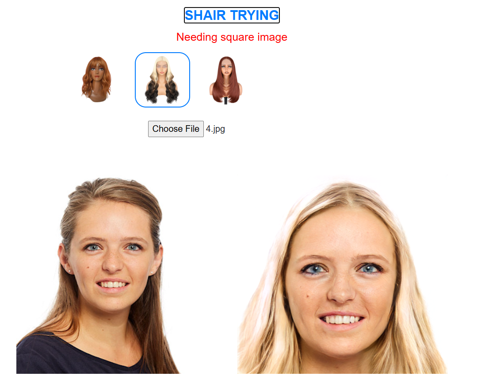
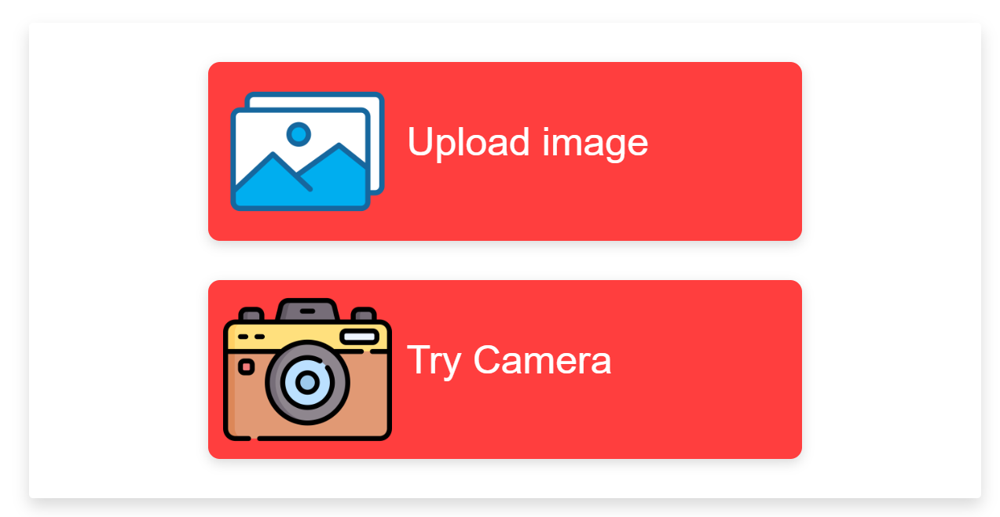

# I'm using GAN model to swap face with wig

## Demo video

<a href='https://youtu.be/1I4o0s1Dx6I'>
</a>

## Page demo swap hair


## Main page


## Install package
```
pip install -r requirements.txt
```

## Run project
```
python api.py
```